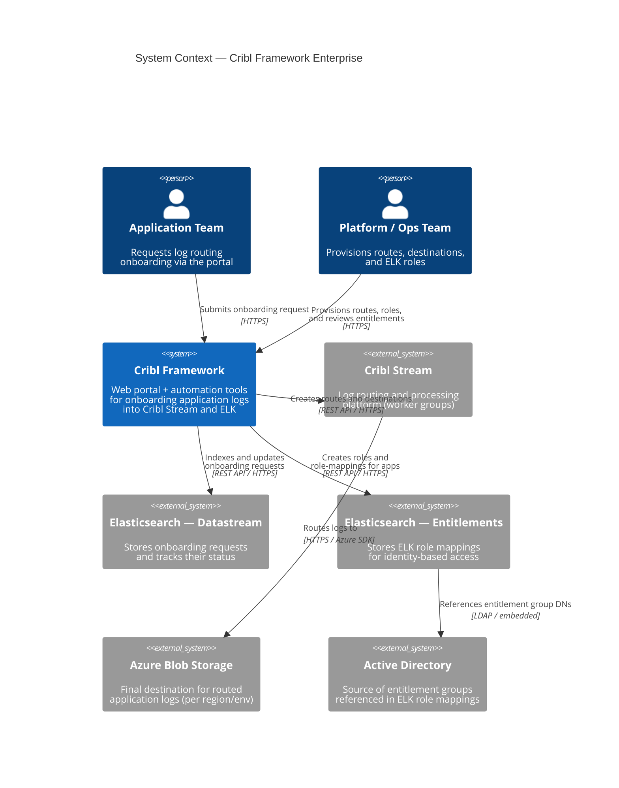
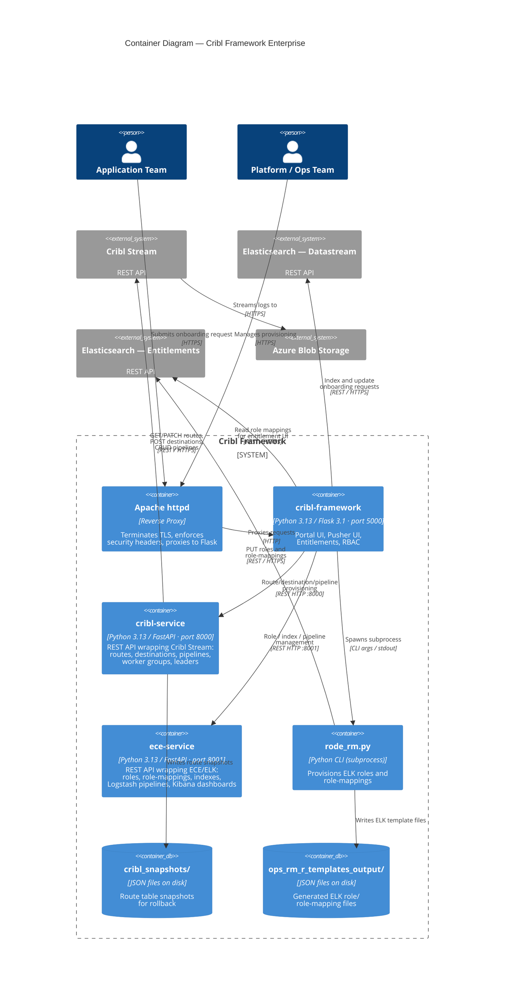
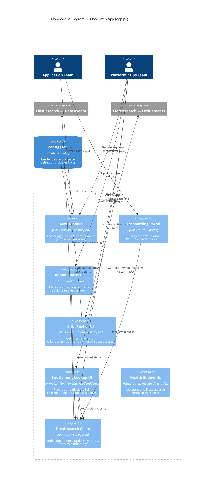
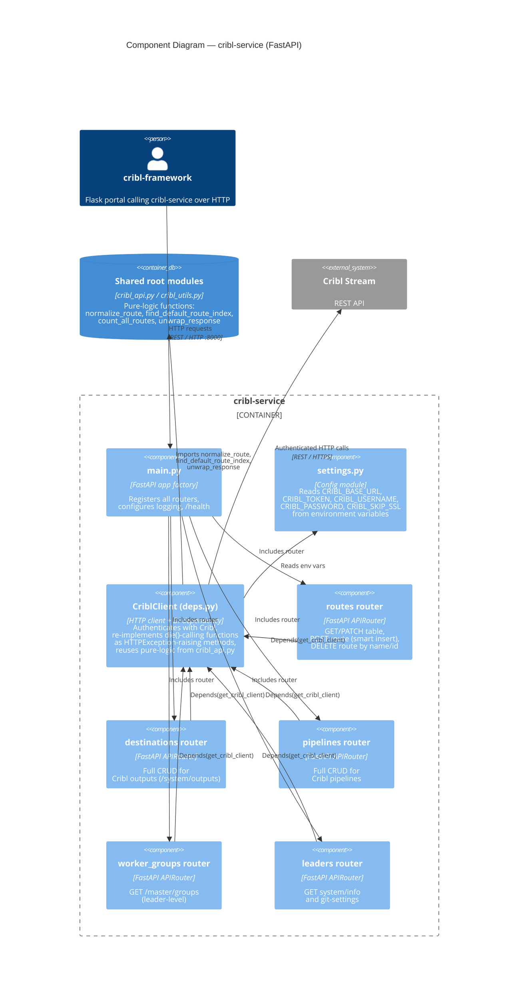
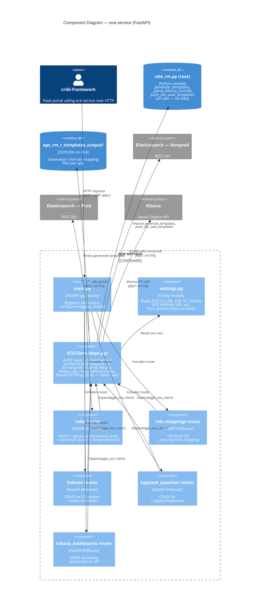

# Cribl Framework — C4 Architecture Diagrams

## Level 1 — System Context

> Who uses the system and what external systems does it depend on?

---

## Level 2 — Container Diagram

> What deployable units make up the system?

---

## Level 3 — Component Diagram (Flask Web App)

> What are the major components inside the Flask container?

---

## Level 3 — Component Diagram (cribl_service)

> What are the major components inside the cribl-service container?

---

## Level 3 — Component Diagram (ece_service)

> What are the major components inside the ece-service container?

---

## Diagram Summary

| Level | Diagram | Audience |
|-------|---------|----------|
| 1 — System Context | Who uses it, what it integrates with | Everyone — management, clients, ops |
| 2 — Container | Deployable units and their communication | Architects, DevOps |
| 3 — Component (Flask) | Internal structure of cribl-framework | Developers |
| 3 — Component (cribl-service) | Internal structure of cribl-service | Developers |
| 3 — Component (ece-service) | Internal structure of ece-service | Developers |
