# Cribl GitOps — Mermaid Diagrams

All architecture diagrams for the Cribl GitOps full-automation design. Each diagram is standalone and can be exported individually with mermaid-cli (`mmdc -i file.md -o file.png`).

---

## 1. Current State

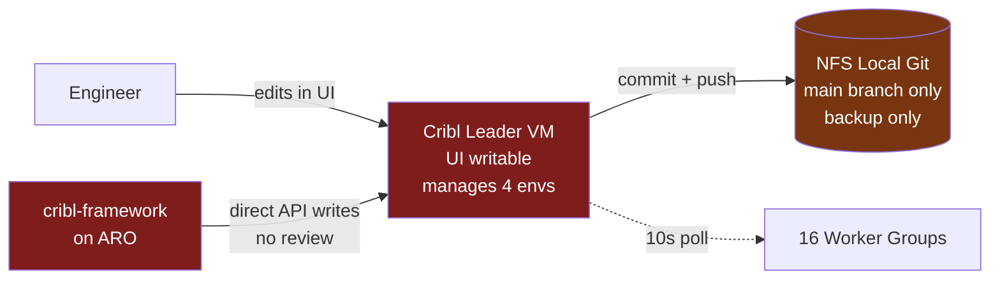

---

## 2. Target State

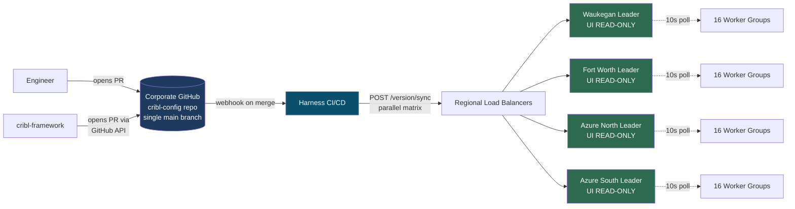

---

## 3. Topology Constraint — One Leader, All Envs

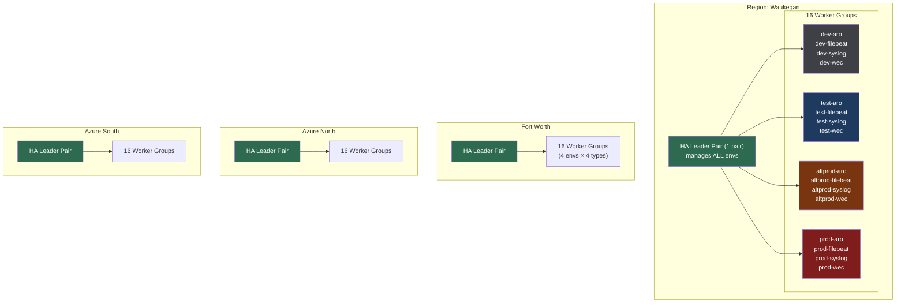

---

## 4. Core GitOps Flow

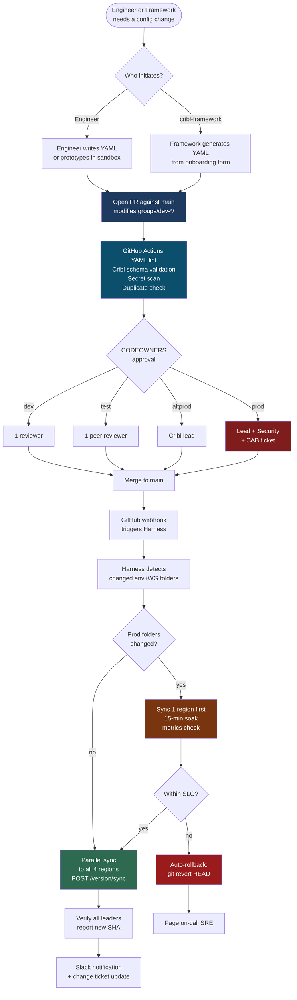

---

## 5. Folder-Based Promotion Model

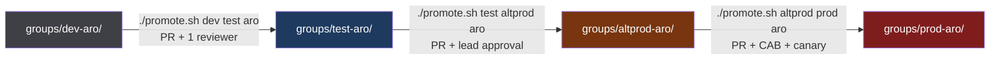

---

## 6. Change Type A — Daily Pipeline / Route / Source / Destination

```mermaid
flowchart TD
    E[Engineer needs new Route<br/>for application X]
    SANDBOX[Prototype in<br/>sandbox Cribl VM]
    YAML[Write YAML or copy<br/>from sandbox output]
    PR1[PR #1: modifies<br/>groups/dev-aro/.../routes.yml]
    CI1[CI: lint + schema + secrets]
    MERGE1[Merge to main]
    SYNC1[Harness syncs all 4 regions<br/>only dev-aro redeploys]
    VALIDATE[Validate in dev-aro WG]
    PROMOTE1[./scripts/promote.sh dev test aro]
    PR2[Auto-generated PR #2:<br/>dev-aro to test-aro]
    MERGE2[Peer review + merge]
    SYNC2[Harness syncs test-aro]
    PROMOTE2[./scripts/promote.sh test altprod aro]
    PR3[Auto-PR #3:<br/>test-aro to altprod-aro]
    MERGE3[Lead review + merge]
    SYNC3[Harness syncs altprod-aro]
    PROMOTE3[./scripts/promote.sh altprod prod aro]
    PR4[Auto-PR #4:<br/>altprod-aro to prod-aro]
    CAB[CAB approval<br/>+ change ticket]
    MERGE4[Merge]
    CANARY[Canary: 1 region<br/>15-min soak]
    ROLLOUT[Parallel rollout<br/>to remaining 3 regions]
    DONE([Production deployment complete])

    E --> SANDBOX --> YAML --> PR1 --> CI1 --> MERGE1 --> SYNC1 --> VALIDATE
    VALIDATE --> PROMOTE1 --> PR2 --> MERGE2 --> SYNC2
    SYNC2 --> PROMOTE2 --> PR3 --> MERGE3 --> SYNC3
    SYNC3 --> PROMOTE3 --> PR4 --> CAB --> MERGE4 --> CANARY --> ROLLOUT --> DONE

    style SANDBOX fill:#1e3a5f,color:#fff
    style CAB fill:#7f1d1d,color:#fff
    style CANARY fill:#78350f,color:#fff
    style DONE fill:#2d6a4f,color:#fff
```

---

## 7. Change Type B — Application Onboarding via Framework

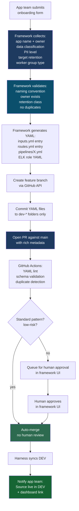

---

## 8. Change Type C — Worker Group / Infrastructure

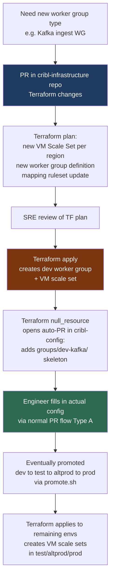

---

## 9. Harness Pipeline End-to-End

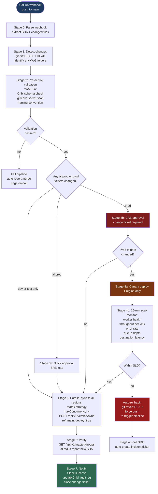

---

## 10. HA Leader Architecture (Per Region)

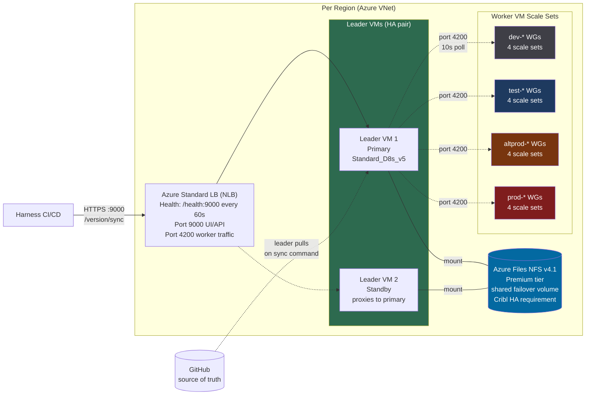

---

## 11. Drift Detection & Self-Healing

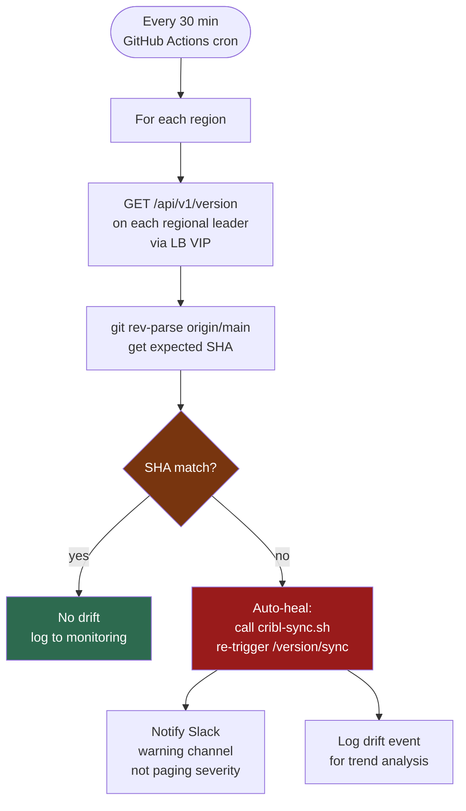

---

## 12. Rollback Flow

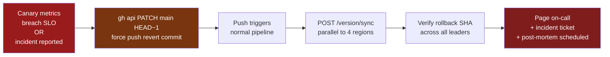

---

## 13. Migration Phases

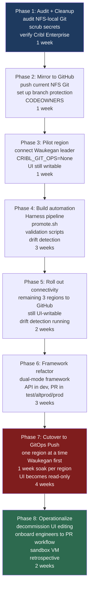

---

## 14. Repository Structure (visual tree)

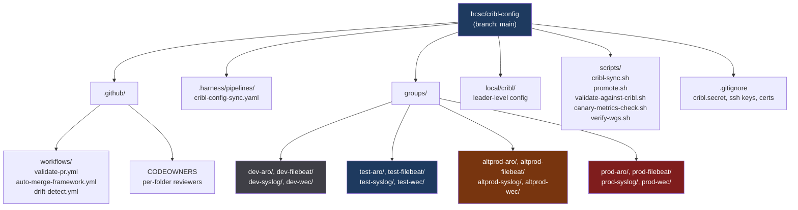

---

## 15. CODEOWNERS Access Control (folder to reviewer mapping)

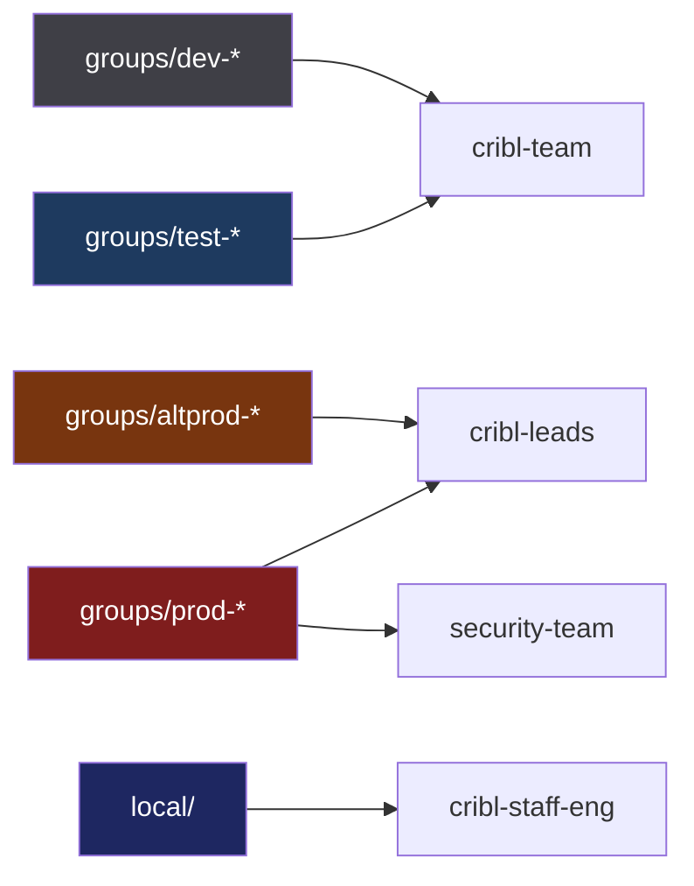

---

## 16. Summary — The Full Picture

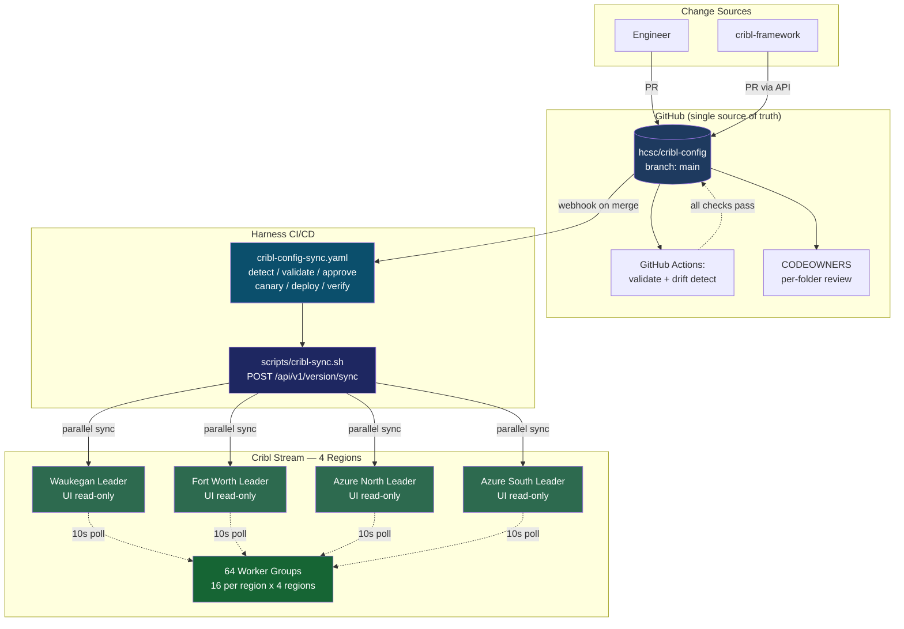
