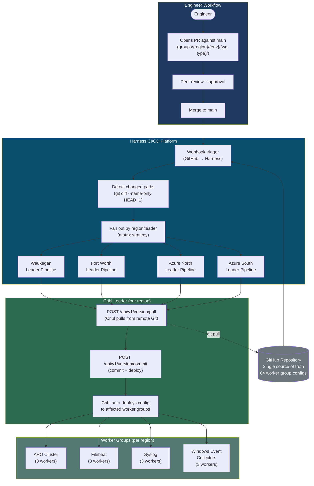
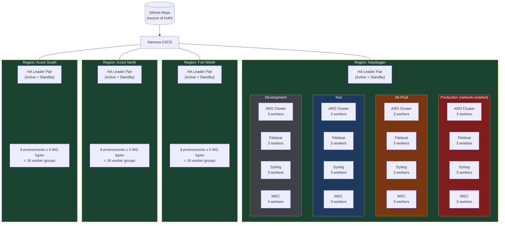
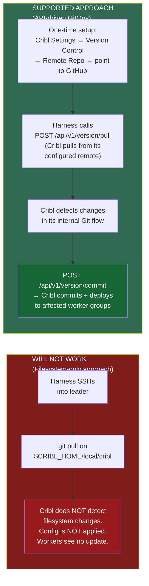
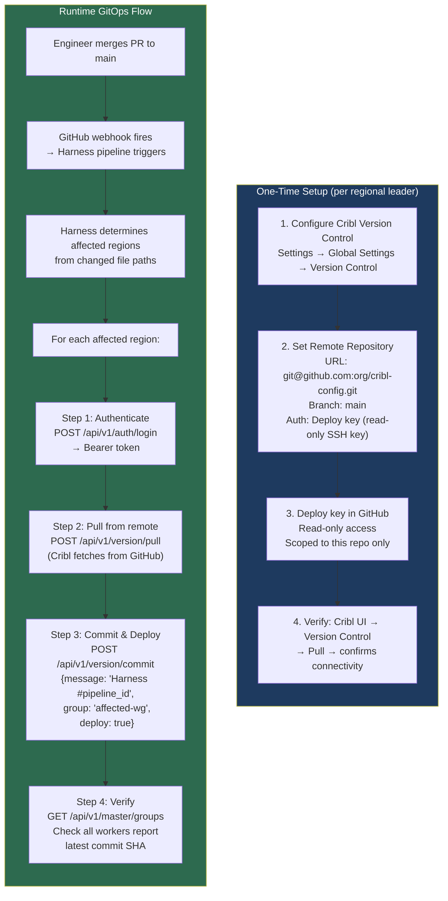
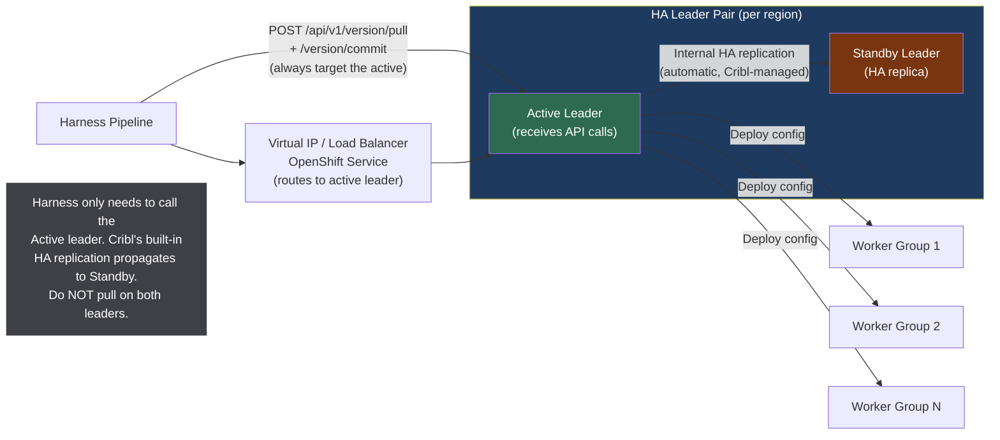

# Cribl GitOps on Azure Red Hat OpenShift — Architecture & CI/CD

## Table of Contents

1. [High-Level GitOps Architecture](#1-high-level-gitops-architecture)
2. [Regional Topology — 4 Regions x 4 Environments x 4 Worker Groups](#2-regional-topology)
3. [Azure Red Hat OpenShift (ARO) Deployment Architecture](#3-aro-deployment-architecture)
4. [Harness CI/CD Pipeline Flow](#4-harness-cicd-pipeline-flow)
5. [Cribl Git Integration — How It Actually Works](#5-cribl-git-integration)
6. [Recommended Architecture (API-Driven GitOps)](#6-recommended-architecture)
7. [Git Repository Structure](#7-git-repository-structure)
8. [HA Leader Replication & Failover](#8-ha-leader-replication)
9. [Answers to Specific Questions](#9-answers-to-specific-questions)
10. [Production Best Practices](#10-production-best-practices)
11. [Visio Reference](#11-visio-reference)

---

## 1. High-Level GitOps Architecture

> End-to-end flow from engineer PR to Cribl worker group deployment.



---

## 2. Regional Topology

> 4 regions x 4 environments x 4 worker group types = 64 worker groups total.



---

## 3. ARO Deployment Architecture

> How the Cribl Framework and Cribl Stream run on Azure Red Hat OpenShift, including the OTel telemetry pipeline.

```mermaid
flowchart TB
    subgraph AZURE_CLOUD["Azure Cloud"]
        subgraph ARO_CLUSTER["Azure Red Hat OpenShift Cluster"]
            subgraph INFRA_NS["Namespace: cribl-infra"]
                direction TB
                INGRESS["OpenShift Route\n(TLS termination\nEdge / Re-encrypt)"]
                FLASK_DEP["Deployment: cribl-framework\nFlask :5000\nreplicas: 2"]
                CS_DEP["Deployment: cribl-service\nFastAPI :8001\nreplicas: 2"]
                ECE_DEP["Deployment: ece-service\nFastAPI :8002\nreplicas: 2"]
                OTEL_DS["DaemonSet: otel-collector\nOpenTelemetry Collector\nOTLP gRPC :4317\nOTLP HTTP :4318"]

                SVC_FLASK["Service: cribl-framework\nClusterIP :5000"]
                SVC_CS["Service: cribl-service\nClusterIP :8001"]
                SVC_ECE["Service: ece-service\nClusterIP :8002"]
                SVC_OTEL["Service: otel-collector\nClusterIP :4317 / :4318"]

                INGRESS --> SVC_FLASK
                SVC_FLASK --> FLASK_DEP
                FLASK_DEP --> SVC_CS
                FLASK_DEP --> SVC_ECE
                SVC_CS --> CS_DEP
                SVC_ECE --> ECE_DEP

                FLASK_DEP -->|"OTLP traces + metrics\n:4318 HTTP"| SVC_OTEL
                CS_DEP -->|"OTLP traces + metrics\n:4318 HTTP"| SVC_OTEL
                ECE_DEP -->|"OTLP traces + metrics\n:4318 HTTP"| SVC_OTEL
                SVC_OTEL --> OTEL_DS
            end

            subgraph CRIBL_NS["Namespace: cribl-stream"]
                direction TB
                LEADER_SS["StatefulSet: cribl-leader\nHA pair (2 replicas)\nPVC for $CRIBL_HOME"]
                WORKER_DEP_ARO["Deployment: cribl-worker-aro\nreplicas: 3\n(per environment)"]
                WORKER_DEP_FB["Deployment: cribl-worker-filebeat\nreplicas: 3"]
                WORKER_DEP_SYS["Deployment: cribl-worker-syslog\nreplicas: 3"]
                WORKER_DEP_WEC["Deployment: cribl-worker-wec\nreplicas: 3"]

                CRIBL_OTEL_IN["Cribl Source: OTel\n(OTLP gRPC :4317\nor HTTP :4318)"]
                CRIBL_PIPELINE["Cribl Pipeline:\nparse, enrich, route,\nredact PII, sample"]

                SVC_LEADER["Service: cribl-leader\nClusterIP :9000"]
                SVC_LEADER_API["Service: cribl-leader-api\nClusterIP :9000\n(API endpoint)"]
                SVC_CRIBL_OTEL["Service: cribl-otel-input\nClusterIP :4317"]

                SVC_LEADER --> LEADER_SS
                SVC_LEADER_API --> LEADER_SS
                LEADER_SS --> WORKER_DEP_ARO
                LEADER_SS --> WORKER_DEP_FB
                LEADER_SS --> WORKER_DEP_SYS
                LEADER_SS --> WORKER_DEP_WEC

                SVC_CRIBL_OTEL --> CRIBL_OTEL_IN
                CRIBL_OTEL_IN --> CRIBL_PIPELINE
            end

            subgraph SECRETS_NS["Namespace: cribl-secrets"]
                direction TB
                SEALED_SECRETS["SealedSecrets\n(Bitnami)"]
                VAULT["HashiCorp Vault\n(External Secrets Operator)\nCribl tokens, ELK creds,\nGit SSH keys"]
            end
        end

        ACR["Azure Container\nRegistry (ACR)\nContainer images"]
        KEYVAULT["Azure Key Vault\nSecrets backend"]
        BLOB["Azure Blob Storage\nLog destination"]

        ELK[("Elasticsearch / Kibana\n(observability backend)")]
        DYNATRACE[("Dynatrace\n(APM backend)")]
    end

    CS_DEP -->|"Cribl REST API :9000"| SVC_LEADER_API
    OTEL_DS -->|"Export OTLP\nto Cribl Stream"| SVC_CRIBL_OTEL
    CRIBL_PIPELINE -->|"Route: traces/metrics\n→ Dynatrace"| DYNATRACE
    CRIBL_PIPELINE -->|"Route: logs/metrics\n→ ELK"| ELK
    CRIBL_PIPELINE -->|"Route: raw logs\n→ Blob (archive)"| BLOB
    VAULT --> KEYVAULT
    ACR --> FLASK_DEP
    ACR --> CS_DEP
    ACR --> ECE_DEP

    style AZURE_CLOUD fill:#0f172a,color:#fff
    style ARO_CLUSTER fill:#1e293b,color:#fff
    style INFRA_NS fill:#1e3a5f,color:#fff
    style CRIBL_NS fill:#2d6a4f,color:#fff
    style SECRETS_NS fill:#78350f,color:#fff
    style ELK fill:#b45309,color:#fff
    style DYNATRACE fill:#6d28d9,color:#fff
```



---

### 3a. OTel Telemetry Pipeline — Detailed Flow

> Framework services generate OTel → OTel Collector → Cribl Stream → ELK and/or Dynatrace.

```mermaid
flowchart LR
    subgraph SOURCES["Telemetry Sources (Framework)"]
        direction TB
        FLASK["cribl-framework\n(Flask + otel_setup.py)\nTraces: request spans\nMetrics: request count,\nlatency histograms\nLogs: structured JSON"]
        CS["cribl-service\n(FastAPI + OTel middleware)\nTraces: Cribl API call spans\nMetrics: API latency,\nerror rates"]
        ECE["ece-service\n(FastAPI + OTel middleware)\nTraces: ELK API call spans\nMetrics: role/index\noperation counts"]
    end

    subgraph COLLECTOR["OTel Collector (DaemonSet)"]
        direction TB
        RECV["Receivers:\notlp (gRPC :4317)\notlp (HTTP :4318)"]
        PROC["Processors:\nbatch (200ms / 512 items)\nmemory_limiter (512Mi)\nresource (add k8s metadata:\nnamespace, pod, node)"]
        EXPORT["Exporters:\notlp/cribl (Cribl Stream\nOTLP input :4317)"]

        RECV --> PROC --> EXPORT
    end

    subgraph CRIBL_STREAM["Cribl Stream (Worker Group: ARO Cluster)"]
        direction TB
        CRIBL_IN["Source: OpenTelemetry\n(OTLP gRPC :4317)"]
        CRIBL_PIPE["Pipeline: otel-routing"]
        CRIBL_PARSE["Function: Eval\n- Extract service.name\n- Extract trace_id\n- Normalize severity"]
        CRIBL_ROUTE["Function: Router\n(route by signal type\nand destination)"]

        CRIBL_IN --> CRIBL_PIPE --> CRIBL_PARSE --> CRIBL_ROUTE
    end

    subgraph DESTINATIONS["Destinations"]
        direction TB
        ELK_DEST["Elasticsearch / Kibana\n- Logs → data stream\n  (otel-logs-cribl-framework)\n- Metrics → data stream\n  (otel-metrics-cribl-framework)\n- Dashboards for ops"]
        DT_DEST["Dynatrace\n- Traces → distributed tracing\n  (OTLP ingest endpoint)\n- Metrics → custom metrics\n- Real-time APM + alerting"]
        BLOB_DEST["Azure Blob Storage\n- All signals (archive)\n- Parquet / JSON format\n- 90-day retention"]
    end

    FLASK -->|"OTLP HTTP\n:4318"| RECV
    CS -->|"OTLP HTTP\n:4318"| RECV
    ECE -->|"OTLP HTTP\n:4318"| RECV

    EXPORT -->|"OTLP gRPC\n:4317"| CRIBL_IN

    CRIBL_ROUTE -->|"traces"| DT_DEST
    CRIBL_ROUTE -->|"logs + metrics"| ELK_DEST
    CRIBL_ROUTE -->|"all (archive)"| BLOB_DEST

    style SOURCES fill:#1e3a5f,color:#fff
    style COLLECTOR fill:#475569,color:#fff
    style CRIBL_STREAM fill:#2d6a4f,color:#fff
    style DESTINATIONS fill:#78350f,color:#fff
    style DT_DEST fill:#6d28d9,color:#fff
    style ELK_DEST fill:#b45309,color:#fff
    style BLOB_DEST fill:#0369a1,color:#fff
```



### Why Cribl in the middle (not direct export)?

| Benefit | Details |
|---------|---------|
| **Route by signal type** | Traces → Dynatrace (best APM), Logs → ELK (best search/dashboards) |
| **Reduce volume** | Sample low-value traces, drop debug logs in prod, aggregate metrics |
| **PII redaction** | Scrub sensitive fields before they reach any backend |
| **Dual-write without code changes** | Send to ELK and Dynatrace simultaneously; add/remove backends without touching app code |
| **Format translation** | Convert OTLP to Dynatrace API format, or to ECS-formatted JSON for ELK |
| **Single egress point** | All telemetry exits through Cribl — one place for firewall rules, audit, and compliance |

---

## 4. Harness CI/CD Pipeline Flow

> Detailed Harness pipeline stages from PR merge to Cribl deployment.

```mermaid
flowchart TD
    subgraph TRIGGER_STAGE["Stage 0: Trigger"]
        WEBHOOK["GitHub Webhook\nEvent: push to main\nBranch: main"]
        WEBHOOK --> PAYLOAD["Parse payload:\nchanged files, commit SHA,\nauthor, PR number"]
    end

    subgraph VALIDATE_STAGE["Stage 1: Validate & Plan"]
        PAYLOAD --> DIFF["Compute affected regions\nfrom changed file paths\n(groups/{region}/**/)"]
        DIFF --> LINT["Config lint:\nYAML/JSON schema validation\nCribl config structure check"]
        LINT --> PLAN["Build deployment matrix:\nwhich leaders need updating"]
    end

    subgraph DEV_STAGE["Stage 2: Deploy to Dev (auto)"]
        PLAN --> DEV_GATE{Dev environments\naffected?}
        DEV_GATE -- Yes --> DEV_AUTH["Authenticate to Cribl\nDev leader(s)\nPOST /api/v1/auth/login"]
        DEV_AUTH --> DEV_PULL["Trigger Git pull\nPOST /api/v1/version/pull"]
        DEV_PULL --> DEV_COMMIT["Commit & deploy\nPOST /api/v1/version/commit\nmessage: Harness #{pipeline_id}"]
        DEV_COMMIT --> DEV_VERIFY["Verify deployment\nGET /api/v1/master/groups\nCheck worker health"]
        DEV_GATE -- No --> DEV_SKIP["Skip dev"]
    end

    subgraph TEST_STAGE["Stage 3: Deploy to Test (auto)"]
        DEV_VERIFY --> TEST_AUTH["Authenticate to Cribl\nTest leader(s)"]
        DEV_SKIP --> TEST_AUTH
        TEST_AUTH --> TEST_PULL["POST /api/v1/version/pull"]
        TEST_PULL --> TEST_COMMIT["POST /api/v1/version/commit"]
        TEST_COMMIT --> TEST_SMOKE["Smoke test:\nSend test event through pipeline\nVerify output arrives at dest"]
    end

    subgraph ALTPROD_STAGE["Stage 4: Deploy to Alt-Prod (approval gate)"]
        TEST_SMOKE --> APPROVAL_1{{"Manual Approval\n(Change Advisory Board\nor team lead)"}}
        APPROVAL_1 --> ALTPROD_PULL["POST /api/v1/version/pull\n(Alt-Prod leaders)"]
        ALTPROD_PULL --> ALTPROD_COMMIT["POST /api/v1/version/commit"]
        ALTPROD_COMMIT --> ALTPROD_VERIFY["Verify worker group health\n+ canary validation"]
    end

    subgraph PROD_STAGE["Stage 5: Deploy to Prod (approval gate + canary)"]
        ALTPROD_VERIFY --> APPROVAL_2{{"Manual Approval\n(CAB + SRE sign-off)"}}
        APPROVAL_2 --> PROD_CANARY["Deploy to 1 region first\n(canary region)"]
        PROD_CANARY --> CANARY_CHECK{Canary healthy\nafter soak period?}
        CANARY_CHECK -- Yes --> PROD_REMAINING["Deploy remaining\nprod regions"]
        CANARY_CHECK -- No --> ROLLBACK["Rollback:\nPOST /api/v1/version/pull\n(revert commit SHA)"]
        PROD_REMAINING --> PROD_VERIFY["Final verification:\nAll 64 worker groups healthy"]
    end

    subgraph NOTIFY_STAGE["Stage 6: Notify"]
        PROD_VERIFY --> NOTIFY["Notify via Slack/Teams:\nDeployment complete\nCommit SHA, affected WGs,\npipeline URL"]
        ROLLBACK --> NOTIFY_FAIL["Notify: Rollback executed\nAlert on-call"]
    end

    style TRIGGER_STAGE fill:#1e3a5f,color:#fff
    style VALIDATE_STAGE fill:#1e3a5f,color:#fff
    style DEV_STAGE fill:#3f3f46,color:#fff
    style TEST_STAGE fill:#1e3a5f,color:#fff
    style ALTPROD_STAGE fill:#78350f,color:#fff
    style PROD_STAGE fill:#7f1d1d,color:#fff
    style NOTIFY_STAGE fill:#2d6a4f,color:#fff
```



---

## 5. Cribl Git Integration — How It Actually Works

> Critical: Cribl does NOT auto-detect external filesystem changes.



### Why the filesystem approach fails

Cribl Stream manages its configuration through an **internal Git workflow**. The local Git repository at `$CRIBL_HOME/local/cribl/` is Cribl's internal state store. Key facts:

1. **Cribl only applies config through its own commit flow** — either via the UI "Commit & Deploy" button or the REST API (`POST /api/v1/version/commit`).
2. **External `git pull` modifies files but does NOT trigger Cribl's config reload** — Cribl does not use filesystem watchers (inotify/fanotify). It only reads config when it starts up or when told to via its API.
3. **Race conditions** — Writing to Cribl's config directory while Cribl is running can cause corruption if Cribl is simultaneously writing (e.g., during a UI commit or worker heartbeat).
4. **HA replication breaks** — Cribl's HA replication is based on its internal commit log, not filesystem sync. External changes won't replicate to standby.

### Where Cribl stores its Git repo on the leader

| Path | Purpose |
|------|---------|
| `$CRIBL_HOME/local/cribl/` | Leader's own configuration |
| `$CRIBL_HOME/groups/<worker-group>/` | Per-worker-group configuration |
| `$CRIBL_HOME/data/` | Runtime data (do not touch) |
| `$CRIBL_HOME/.git/` | Cribl's internal Git repo root |

`$CRIBL_HOME` defaults to `/opt/cribl` (Linux) or wherever Cribl is installed.

---

## 6. Recommended Architecture (API-Driven GitOps)

> The supported production pattern: GitHub as source of truth, Harness as orchestrator, Cribl API as the deployment mechanism.



### Cribl API Calls — Exact Endpoints

```
# Authenticate
POST https://{leader}:9000/api/v1/auth/login
Body: {"username": "harness-svc", "password": "***"}
Response: {"token": "..."}

# Pull latest from GitHub remote
POST https://{leader}:9000/api/v1/version/pull
Headers: Authorization: Bearer {token}
Response: {"items": [...], "count": N}

# Commit and deploy to worker groups
POST https://{leader}:9000/api/v1/version/commit
Headers: Authorization: Bearer {token}
Body: {
  "message": "Harness pipeline #12345 — PR #678",
  "group": "default",         // or specific worker group
  "deploy": true              // auto-deploy to workers
}

# Verify worker group health
GET https://{leader}:9000/api/v1/master/groups
Headers: Authorization: Bearer {token}
# Check each group's workers[].configVersion matches latest
```

---

## 7. Git Repository Structure

> Folder layout in GitHub that maps to Cribl's internal group structure.

```
cribl-config/                          # GitHub repo root
├── README.md
├── .harness/                          # Harness pipeline definitions
│   ├── pipeline.yaml                  # Main CI/CD pipeline
│   └── templates/
│       └── deploy-region.yaml         # Reusable stage template
│
├── groups/                            # Mirrors $CRIBL_HOME/groups/
│   ├── waukegan/
│   │   ├── production/
│   │   │   ├── aro-cluster/
│   │   │   │   ├── local/cribl/
│   │   │   │   │   ├── outputs.yml
│   │   │   │   │   ├── routes.yml
│   │   │   │   │   └── pipelines/
│   │   │   │   │       ├── syslog-parse.yml
│   │   │   │   │       └── json-cleanup.yml
│   │   │   │   └── README.md
│   │   │   ├── filebeat/
│   │   │   │   └── local/cribl/...
│   │   │   ├── syslog/
│   │   │   │   └── local/cribl/...
│   │   │   └── windows-event-collectors/
│   │   │       └── local/cribl/...
│   │   ├── alt-prod/
│   │   │   ├── aro-cluster/...
│   │   │   ├── filebeat/...
│   │   │   ├── syslog/...
│   │   │   └── windows-event-collectors/...
│   │   ├── test/
│   │   │   └── ...
│   │   └── development/
│   │       └── ...
│   ├── fort-worth/
│   │   └── ...  (same structure)
│   ├── azure-north/
│   │   └── ...
│   └── azure-south/
│       └── ...
│
├── shared/                            # Shared pipelines/lookups
│   ├── pipelines/
│   │   └── common-enrichment.yml
│   └── lookups/
│       └── geo-ip.csv
│
└── scripts/                           # Utility scripts
    ├── validate-config.py             # Pre-merge config validation
    └── diff-report.py                 # Generates human-readable diff
```

---

## 8. HA Leader Replication

> How Cribl HA leaders handle config propagation.



### Key HA behaviors:

| Scenario | Behavior |
|----------|----------|
| API call to active leader | Cribl replicates to standby automatically |
| Active leader fails | Standby promotes to active; Harness VIP failover routes to new active |
| External `git pull` on active only | **NOT replicated** — HA replication is tied to Cribl's internal commit log |
| External `git pull` on both leaders | **Dangerous** — can cause split-brain; never do this |

---

## 9. Answers to Specific Questions

### Q1: Filesystem change detection

**No.** Cribl does not use inotify or any filesystem watcher. If Harness runs `git pull` directly on the leader's filesystem, Cribl will not detect or apply those changes. Config is only applied when:
- A commit is made through the Cribl UI, or
- The REST API endpoints `/api/v1/version/pull` and `/api/v1/version/commit` are called.

### Q2: Recommended path for filesystem-based config updates

The **supported** path is Cribl's built-in Git integration:
1. Configure a remote Git repository in Cribl's Version Control settings.
2. Use `POST /api/v1/version/pull` to tell Cribl to fetch from the remote.
3. Use `POST /api/v1/version/commit` with `deploy: true` to apply.

Directly editing files under `$CRIBL_HOME/groups/` is **not supported** and will not trigger deployment. It can also corrupt Cribl's internal state.

### Q3: Where Cribl's local Git repo lives

- **Git repo root:** `$CRIBL_HOME/.git/` (the entire `$CRIBL_HOME` directory is the working tree)
- **Leader config:** `$CRIBL_HOME/local/cribl/`
- **Worker group configs:** `$CRIBL_HOME/groups/<worker-group-name>/local/cribl/`
- Default `$CRIBL_HOME`: `/opt/cribl` on Linux

Harness should **not** run `git pull` against this directory. Instead, Harness should call the API.

### Q4: HA leader behavior with external git pull

Cribl's HA replication only tracks changes made through Cribl's own commit flow. An external `git pull`:
- **Will NOT replicate** to the standby leader
- Could cause **divergence** between active and standby configs
- On failover, the standby would revert to its last known-good config

**Recommendation:** Always call the API on the active leader via the VIP/service. Cribl handles replication.

### Q5: Auto-deploy granularity

When using the API (`POST /api/v1/version/commit` with `deploy: true`):
- Cribl deploys **only the affected worker groups** whose config files changed
- Workers detect the new config version via their heartbeat and pull the update
- Typical propagation time: 10–30 seconds per worker group

### Q6: Risks of bypassing the UI/API

| Risk | Impact |
|------|--------|
| No filesystem watchers | Changes silently ignored until restart |
| File locking | Cribl may be writing to the same files during worker heartbeats |
| HA desync | Standby leader won't receive the changes |
| Internal Git state corruption | Cribl's `.git/` state diverges from on-disk files |
| Audit trail gaps | Cribl's internal audit log won't record the change |
| Rollback impossible | Cribl's rollback feature relies on its own commit history |

**If you must re-read config after an external change** (e.g., disaster recovery): restart the Cribl leader process. But this is not recommended for routine GitOps.

---

## 10. Production Best Practices

### Harness Pipeline Best Practices

| Practice | Details |
|----------|---------|
| **Path-based triggering** | Use `on.push.paths: groups/{region}/**` to only trigger for affected regions |
| **Matrix strategy** | Fan out deployment by region; each region is an independent Harness stage |
| **Environment promotion** | Dev → Test → Alt-Prod → Prod with approval gates between Alt-Prod and Prod |
| **Canary deployment** | Deploy to one prod region first, soak for 15–30 min, then remaining regions |
| **Rollback automation** | On failure, automatically `git revert` and re-run the pipeline |
| **Secrets management** | Store Cribl API credentials in Harness Secrets Manager, backed by Azure Key Vault |
| **Timeout & retry** | Set 5-min timeout per region, 2 retries with exponential backoff |
| **Audit logging** | Log every API call to Cribl with pipeline execution ID for traceability |

### ARO / OpenShift Best Practices

| Practice | Details |
|----------|---------|
| **Leader as StatefulSet** | Use StatefulSet with PVCs for `$CRIBL_HOME` persistence |
| **Workers as Deployments** | Workers are stateless; use Deployments with HPA |
| **Network Policies** | Isolate cribl-stream namespace; only allow ingress from cribl-infra |
| **Pod Disruption Budgets** | `minAvailable: 2` for workers, `minAvailable: 1` for leaders |
| **Resource quotas** | Set per-namespace CPU/memory limits to prevent noisy-neighbor issues |
| **Node affinity** | Pin leaders to infra nodes; workers to compute nodes |
| **Image scanning** | Scan Cribl images in ACR with Microsoft Defender before deployment |
| **SCC (Security Context Constraints)** | Use `restricted-v2` SCC; Cribl runs as non-root |
| **Persistent storage** | Use Azure Managed Disks (Premium SSD) for leader PVCs |
| **TLS everywhere** | Use OpenShift Routes with re-encrypt termination for Cribl API |

### Cribl Git Integration Best Practices

| Practice | Details |
|----------|---------|
| **Deploy keys** | One SSH deploy key per regional leader, read-only, scoped to the repo |
| **Branch strategy** | `main` is production; use feature branches for all changes |
| **PR validation** | Require schema validation + at least 1 reviewer before merge |
| **Config-as-code testing** | Validate Cribl YAML/JSON configs in CI before merge |
| **Commit message convention** | Include PR number and worker group names in commit messages |
| **Version pinning** | Tag releases in Git for rollback targets |
| **Drift detection** | Scheduled Harness pipeline to compare leader config vs Git and alert on drift |

### Security Best Practices

| Practice | Details |
|----------|---------|
| **Service account** | Dedicated `harness-svc` Cribl user with minimal permissions (config pull + commit only) |
| **API token rotation** | Rotate Cribl API tokens every 90 days via Harness Secrets |
| **Network segmentation** | Cribl leader API only accessible from Harness runners (NetworkPolicy) |
| **RBAC in GitHub** | Branch protection on `main`; CODEOWNERS for `groups/` directories |
| **Audit trail** | Cribl internal audit + Harness execution logs + GitHub PR history = full traceability |
| **Sealed Secrets** | Use Bitnami SealedSecrets or External Secrets Operator for K8s secrets |

---

## 11. Visio Reference

### Swim Lanes — Harness GitOps Pipeline

| Lane | Actor |
|------|-------|
| 1 | Engineer |
| 2 | GitHub |
| 3 | Harness CI/CD |
| 4 | Cribl Leader (per region) |
| 5 | Cribl Workers |

### Shapes

| # | Shape | Text | Lane | Color |
|---|-------|------|------|-------|
| G1 | Rounded Rectangle (Start) | Engineer opens PR | 1 | Green |
| G2 | Rectangle | Peer review + approval | 1 | Blue |
| G3 | Rectangle | Merge to main | 2 | Blue |
| G4 | Rectangle | Webhook fires to Harness | 2 | Blue |
| G5 | Rectangle | Parse changed paths | 3 | Blue |
| G6 | Diamond | Region affected? | 3 | Yellow |
| G7 | Rectangle | POST /api/v1/auth/login | 3 | Blue |
| G8 | Rectangle | POST /api/v1/version/pull | 4 | Blue |
| G9 | Rectangle | POST /api/v1/version/commit (deploy:true) | 4 | Blue |
| G10 | Diamond | Workers healthy? | 4 | Yellow |
| G11 | Rectangle | Workers pull new config | 5 | Blue |
| G12 | Rounded Rectangle (End) | Deployment complete | 5 | Green |
| G13 | Rectangle | Rollback: revert commit | 4 | Red |
| G14 | Rectangle | Notify Slack/Teams | 3 | Blue |

### Connections

| From | To | Label |
|------|----|-------|
| G1 | G2 | |
| G2 | G3 | Approved |
| G3 | G4 | push event |
| G4 | G5 | |
| G5 | G6 | |
| G6 | G7 | Yes |
| G6 | G14 | No (skip region) |
| G7 | G8 | Bearer token |
| G8 | G9 | |
| G9 | G10 | |
| G10 | G11 | Yes |
| G10 | G13 | No |
| G11 | G12 | |
| G12 | G14 | |
| G13 | G14 | |

---

## Summary Table

| Layer | Component | Technology | Purpose |
|-------|-----------|------------|---------|
| Source Control | Config repo | GitHub | Single source of truth for 64 WG configs |
| CI/CD | Pipeline | Harness | Orchestrates deployment, gates, rollback |
| Platform | Container runtime | Azure Red Hat OpenShift | Runs Cribl leaders, workers, and framework |
| Secrets | Credential management | Azure Key Vault + ESO | Stores API tokens, SSH keys, ELK creds |
| Observability | Telemetry | OpenTelemetry + otel-collector | Traces, metrics, logs from all services |
| Config Management | Git integration | Cribl built-in Version Control | Leaders pull from GitHub via API |
| Deployment | Config application | Cribl REST API | Pull → commit → auto-deploy to workers |
| HA | Leader redundancy | Cribl HA (active/standby) | Automatic failover + config replication |
| Monitoring | Drift detection | Harness scheduled pipeline | Alert if leader config diverges from Git |
