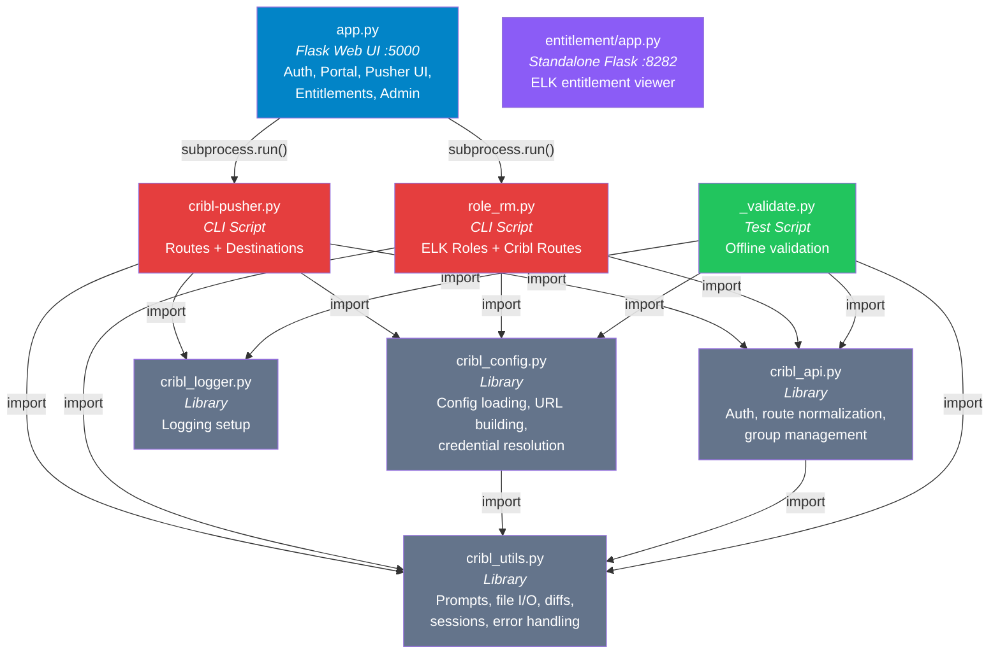
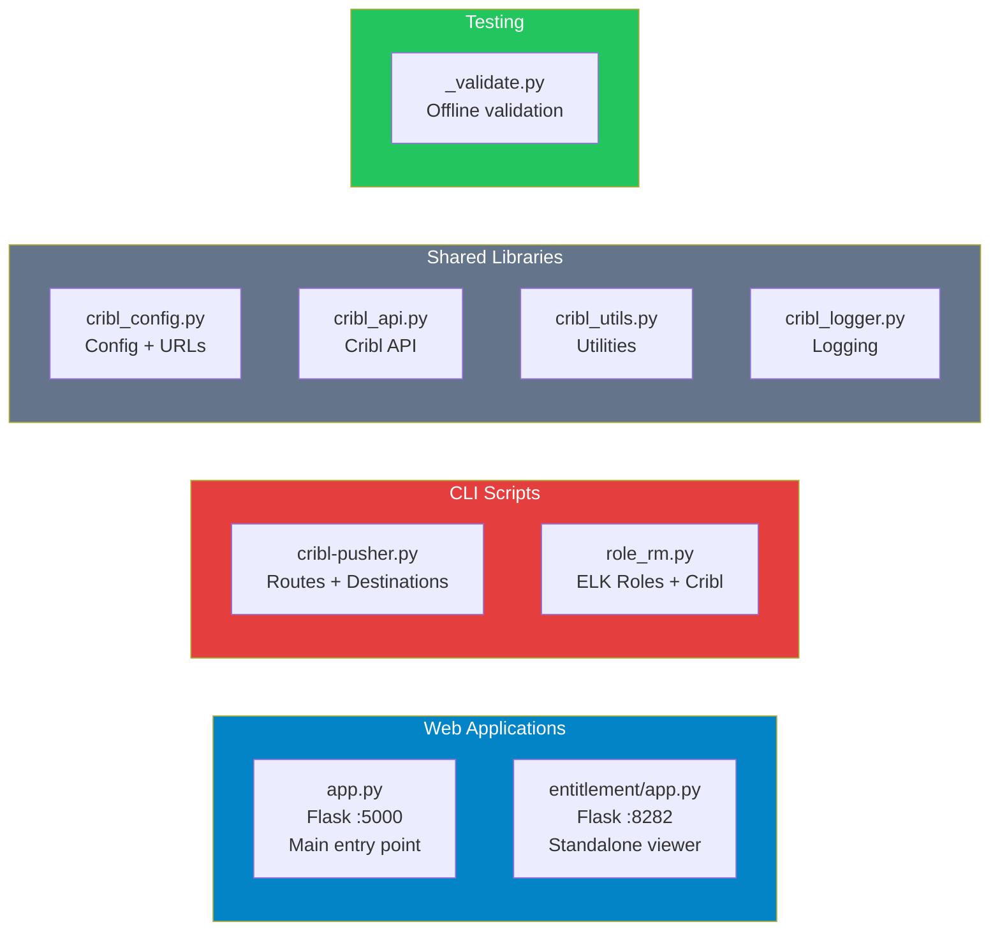
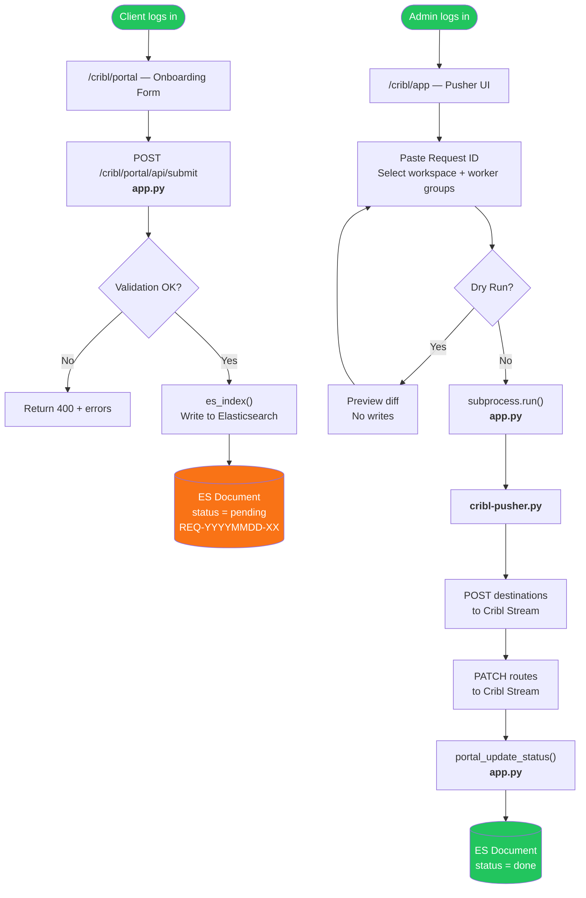
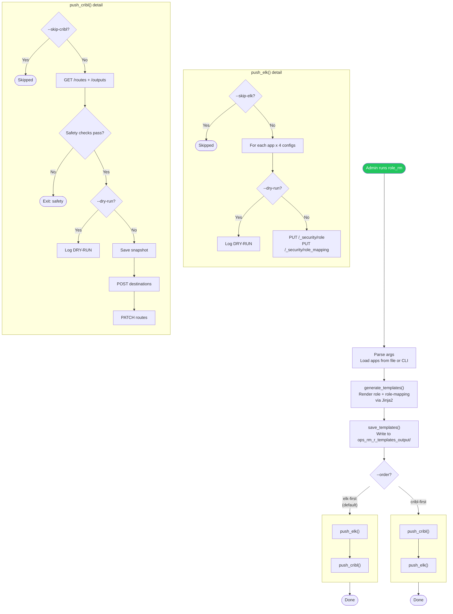
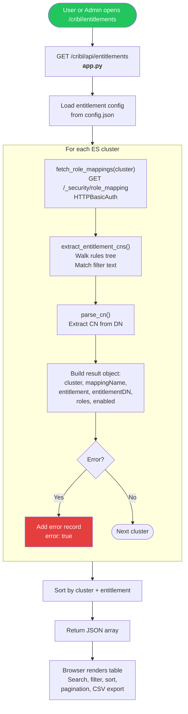
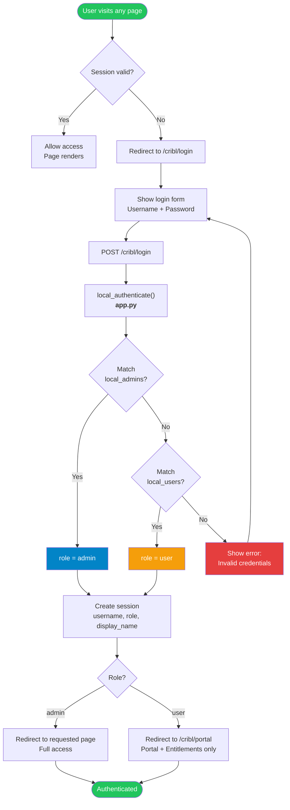
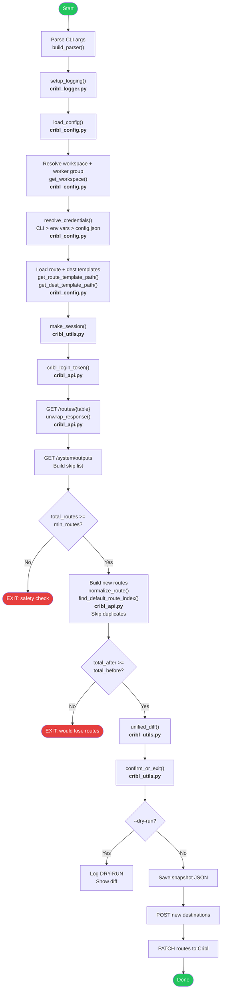
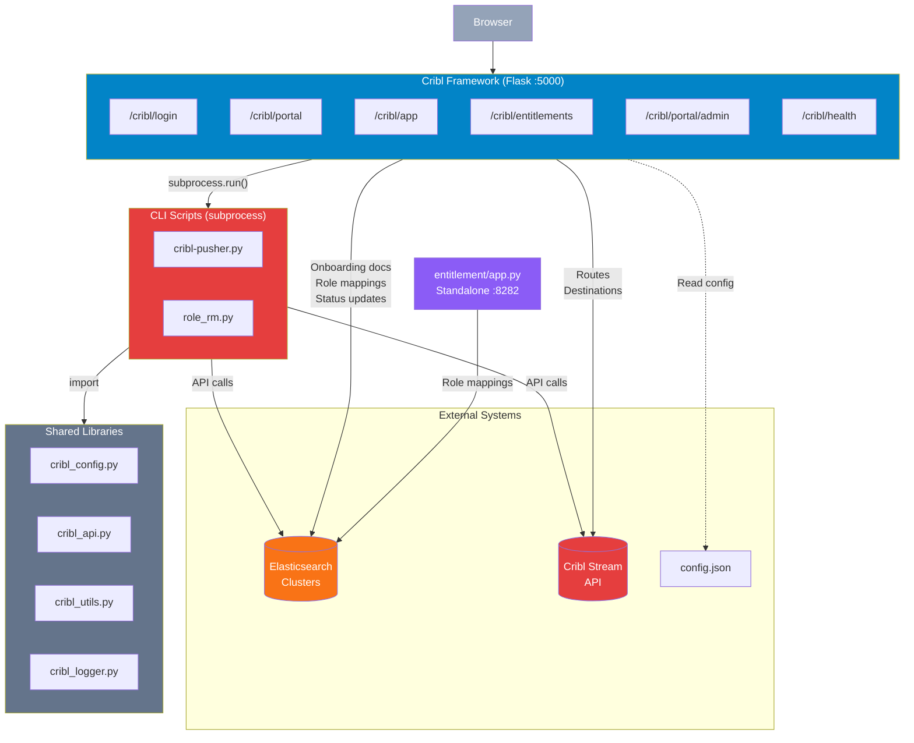
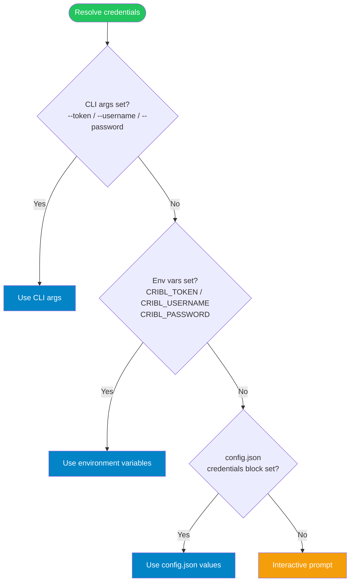
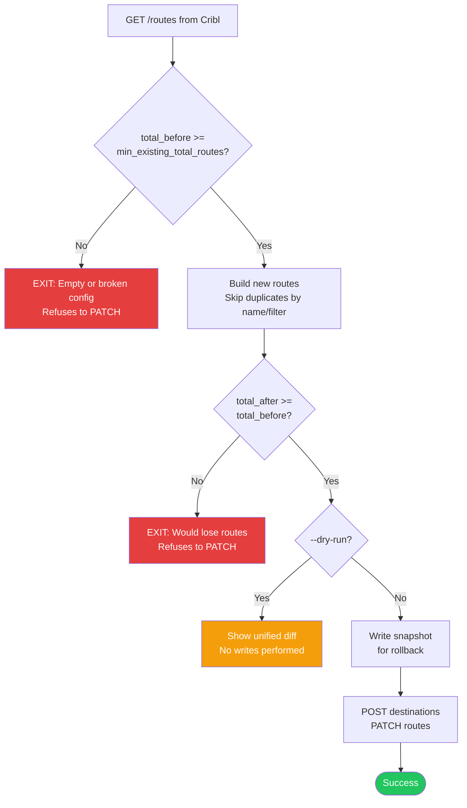

# Cribl Framework — Python Files Flowchart

## 1. Module Dependency Graph

---

## 2. File Purpose Summary

---

## 3. Onboarding Request Lifecycle

---

## 4. ELK Roles + Cribl Routes (role_rm.py)

---

## 5. Entitlement Lookup Flow

---

## 6. Authentication Flow

---

## 7. cribl-pusher.py Internal Flow

---

## 8. Application Architecture

---

## 9. Credential Resolution Order

---

## 10. Safety Checks

