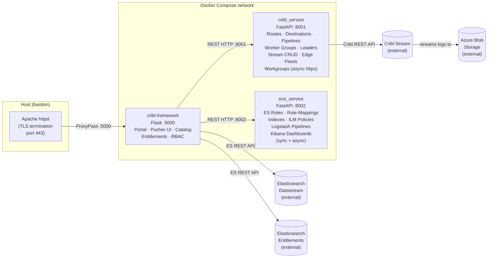
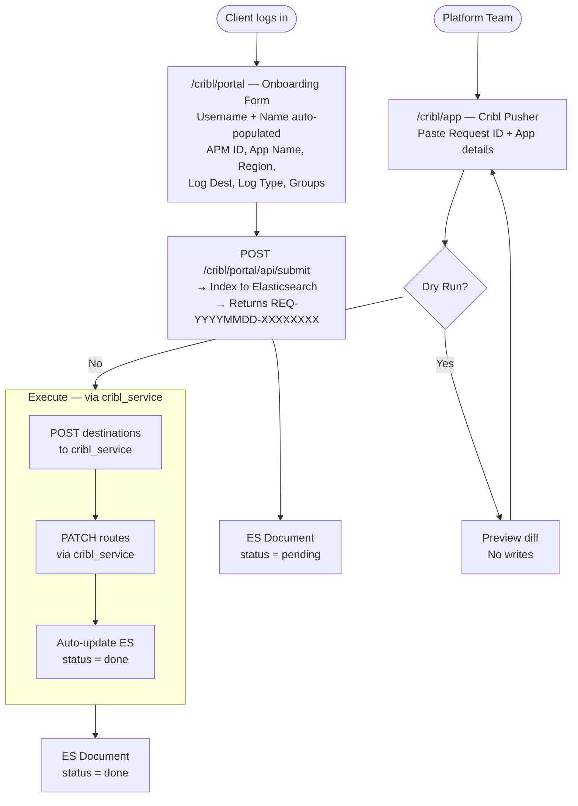
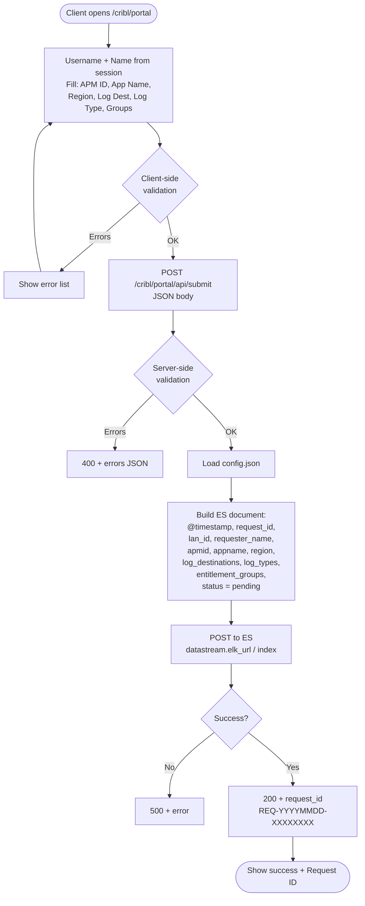
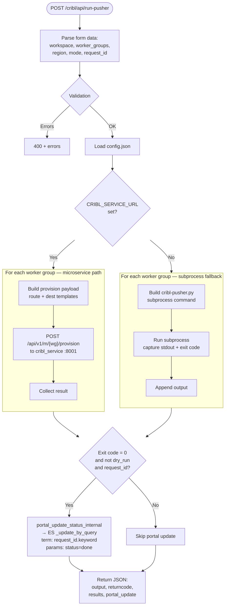
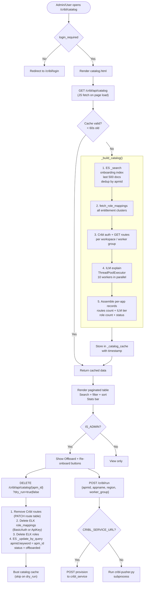
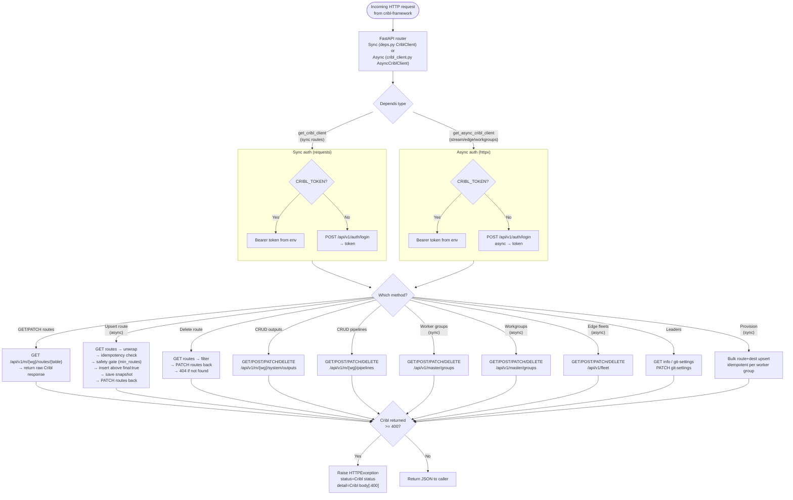
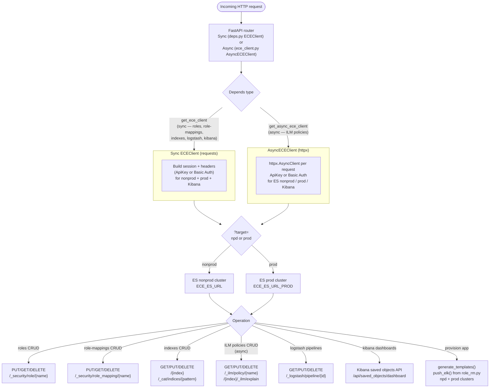
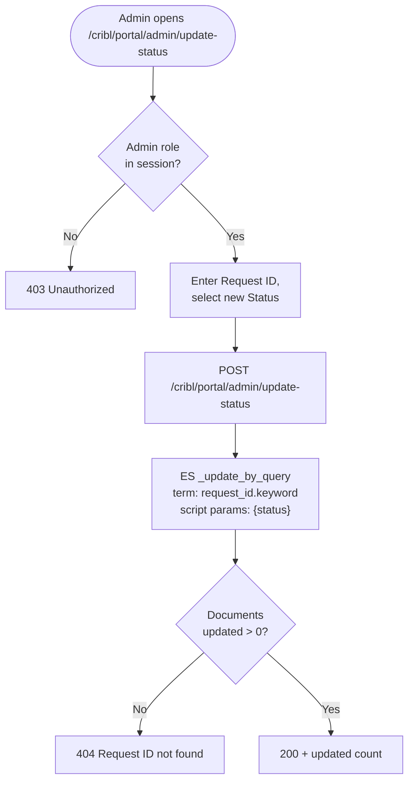

# Cribl Framework — Flowcharts

## Service Architecture

> How the three containers relate at runtime.

---

## End-to-End Onboarding Flow

---

## Portal Submit Flow

---

## Cribl Pusher Flow (app.py /cribl/api/run-pusher)

---

## Service Catalog Flow (/catalog)

---

## role_rm.py Flow

```mermaid
flowchart TD
    START([Start]) --> ARGS[Parse CLI arguments]

    ARGS --> APPS{--from-file?}
    APPS -- Yes --> FILE[read_apps_from_file\nappids.txt or --appfile]
    APPS -- No  --> SINGLE["apps = [(app_name, apmid)]"]
    FILE    --> VAL
    SINGLE  --> VAL

    subgraph VAL[Validate]
        direction TB
        V2[ELK Nonprod URL + creds required]
        V4[ELK Prod URL + creds required]
        V7[Workspace required]
        V1[All skipped if --skip-elk / --skip-cribl]
    end

    VAL --> VALERR{Errors?}
    VALERR -- Yes --> DIE1([Exit with error])
    VALERR -- No  --> TMPL

    TMPL["save_templates (always runs)\nWrite 4 JSON files per app →\nops_rm_r_templates_output/"] --> CONFIRM

    CONFIRM{"--yes or\n--dry-run?"} -- No  --> PROMPT[Prompt: type YES]
    CONFIRM -- Yes --> SESSIONS
    PROMPT --> PCONF{Confirmed?}
    PCONF -- No  --> DIE2([Exit: aborted])
    PCONF -- Yes --> SESSIONS

    SESSIONS["Build ELK sessions\nNonprod + Prod"] --> ORDER

    ORDER{--order} -- elk-first   --> ELK
    ORDER          -- cribl-first --> CRIBL2

    subgraph ELK[run_elk]
        direction TB
        ES{--skip-elk?}
        ES -- Yes --> ELKSKIP([ELK skipped])
        ES -- No  --> ELKLOOP

        subgraph ELKLOOP["For each app x 4 configs"]
            direction TB
            ENVCHECK{"environment\n== prod?"}
            ENVCHECK -- Yes --> USEPROD[Prod URL + session]
            ENVCHECK -- No  --> USENP[Nonprod URL + session]
            USEPROD --> GEN
            USENP   --> GEN
            GEN[generate_templates\nPUSER + USER\nrole + role_mapping] --> DR1{--dry-run?}
            DR1 -- Yes --> DRL1[Log DRY-RUN]
            DR1 -- No  --> ELPUT[PUT role + role_mapping\nx4 per app]
            ELPUT --> PUTRES{200/201?}
            PUTRES -- Yes --> PUTOK[Log OK]
            PUTRES -- No  --> PUTERR[Log ERR]
        end
    end

    subgraph CRIBL[run_cribl]
        direction TB
        CS{--skip-cribl?}
        CS -- Yes --> CRSKIP([Cribl skipped])
        CS -- No  --> LOADCFG[Load config + workspace]
        LOADCFG --> AUTH{token?}
        AUTH -- No  --> LOGIN[POST /api/v1/auth/login]
        AUTH -- Yes --> GR
        LOGIN --> GR
        GR["GET /routes + GET /outputs"] --> SMIN{"total_routes\n>= min_routes?"}
        SMIN -- No  --> DIED3([Exit: safety check])
        SMIN -- Yes --> BUILD["Build new routes + dests\nSkip duplicates"]
        BUILD --> SAFTER{"total_after\n>= total_before?"}
        SAFTER -- No  --> DIED4([Exit: safety check])
        SAFTER -- Yes --> DR2{--dry-run?}
        DR2 -- Yes --> DRL2[Log DRY-RUN]
        DR2 -- No  --> SNAP[Write snapshot] --> POST_D[POST new dests]
        POST_D --> PATCH["PATCH routes"]
        PATCH --> PLOG[Log OK + rollback path]
    end

    ELK    --> CRIBL
    CRIBL2 --> CRIBL3[run_cribl]
    CRIBL3 --> ELK2[run_elk]
    ELK2   --> DONE

    CRIBL  --> DONE([Done])
```

---

## cribl_service — Request Lifecycle

> How a single API call flows through cribl_service internally.

---

## ece_service — Request Lifecycle

---

## Admin Status Update Flow

---

## Summary Table

| Step | Always runs | Description |
|------|:-----------:|-------------|
| Portal submit | on request | Client fills form, doc indexed to ES with `status=pending` |
| Parse args (CLI) | yes | Single app or bulk file |
| Validate | yes | URLs, credentials, workspace |
| Save ELK templates | yes | 4 JSON files per app in `ops_rm_r_templates_output/` |
| Confirm | yes | Auto-confirmed with `--yes` or `--dry-run` |
| `run_elk` | if not `--skip-elk` | PUT roles + role-mappings to correct cluster |
| `run_cribl` | if not `--skip-cribl` | GET → plan → snapshot → POST dests → PATCH routes |
| Auto-update status | if request_id set | ES `_update_by_query` sets `status=done` (uses `.keyword` field) |

## ELK Environment Routing

| Config block | Cluster |
|---|---|
| `test` onshore + offshore | `--elk-url` nonprod |
| `prod` onshore + offshore | `--elk-url-prod` prod |

## Cribl Safety Gates

| Gate | Prevents |
|---|---|
| `total_before >= min_routes` | Running against an empty/broken config |
| `total_after >= total_before` | Accidentally deleting existing routes |
| Duplicate name/filter check | Adding the same route twice |
| Snapshot written before write | Provides rollback point |
| `group_id` sentinel (None) | Searching only first attr key when group in second |
